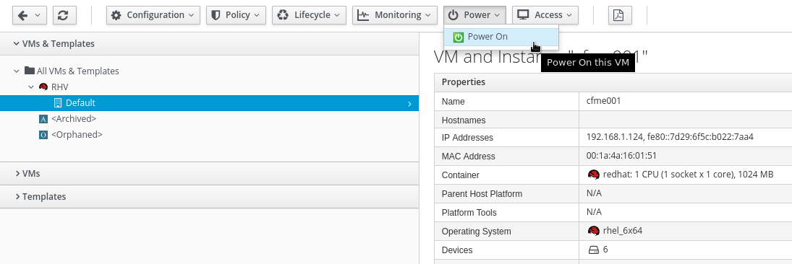
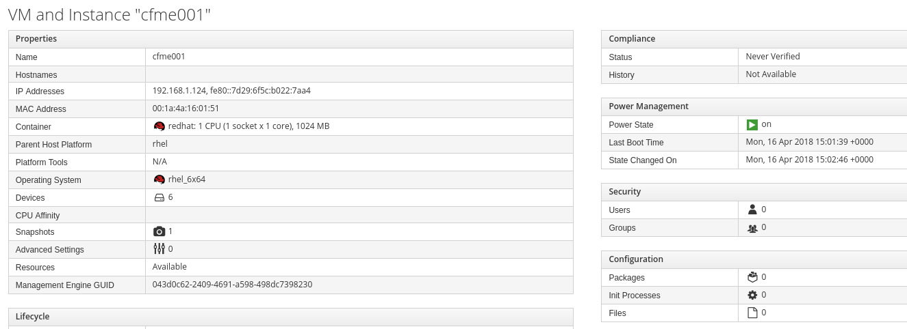
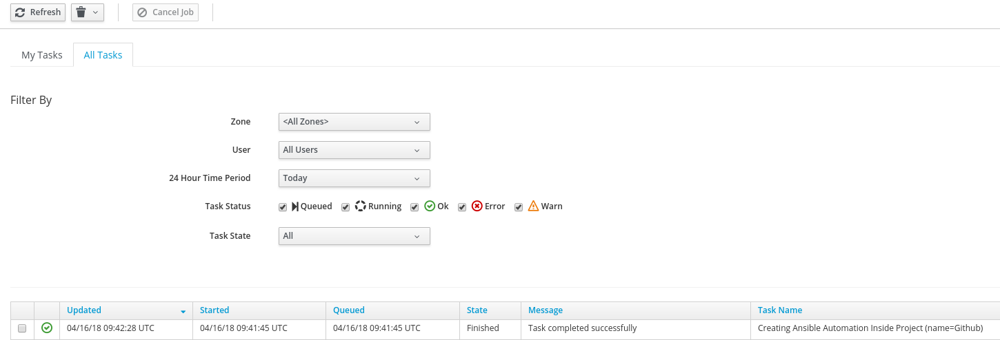
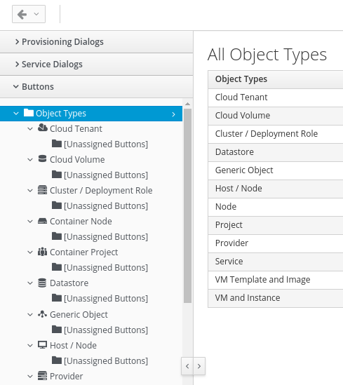
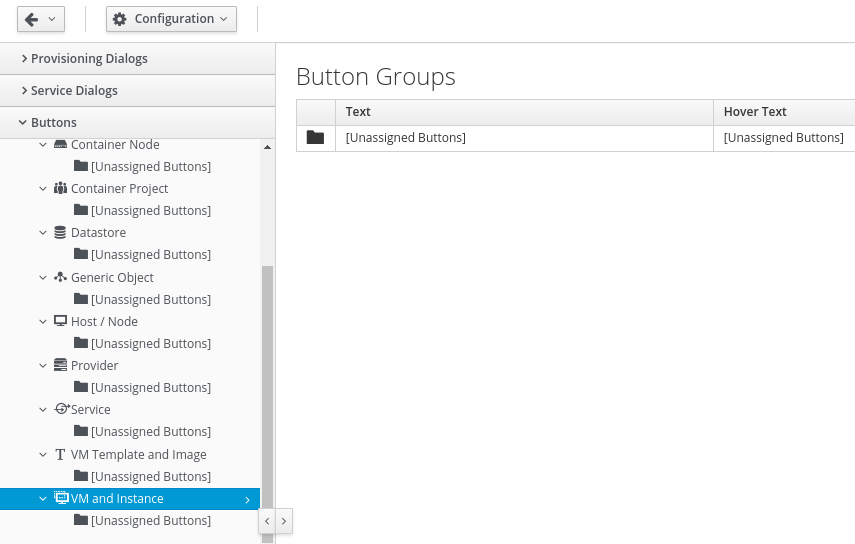
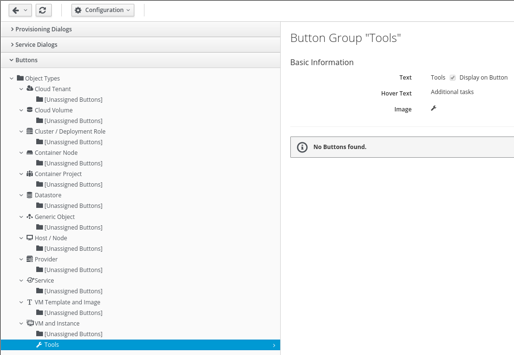
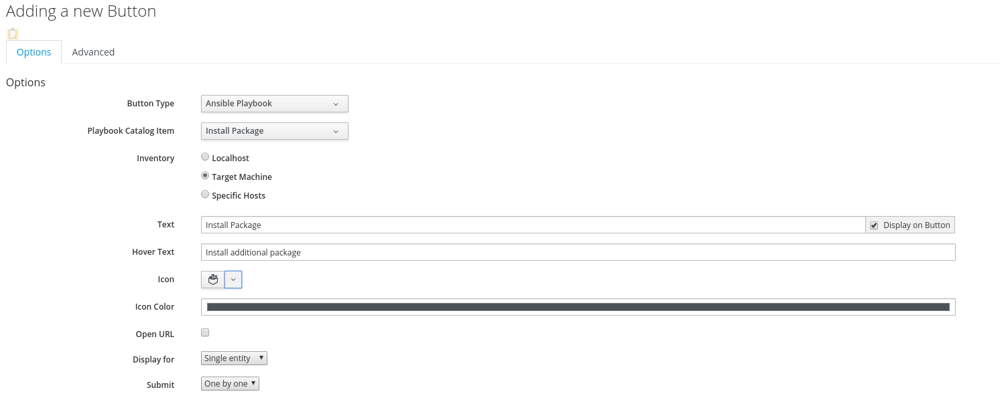
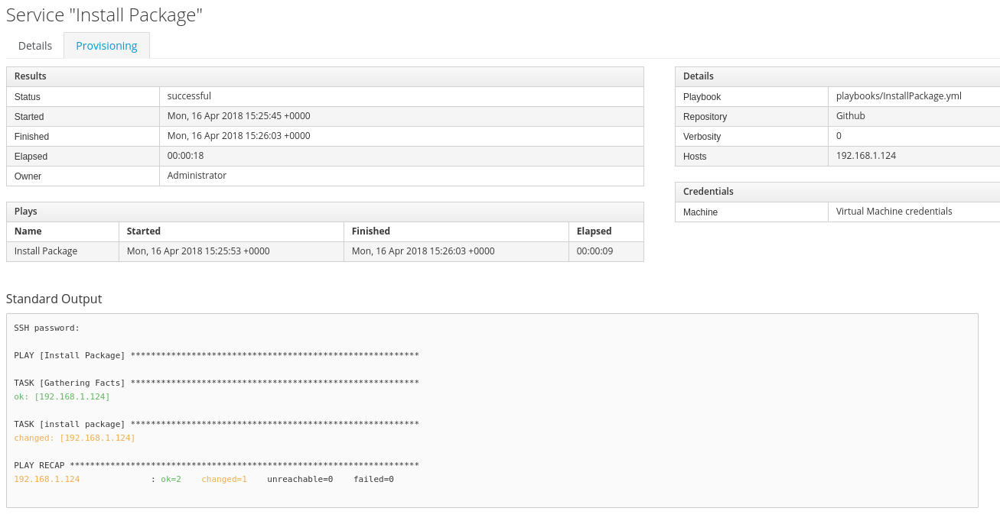
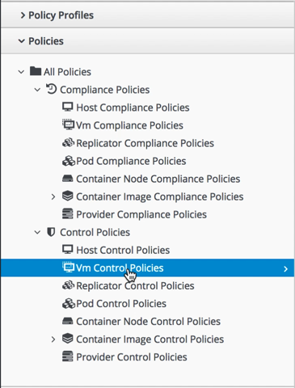

# Lab Introduction

<!-- TOC -->

- [Lab Introduction](#lab-introduction)
    - [Introduction to CloudForms](#introduction-to-cloudforms)
        - [Access the lab environment](#access-the-lab-environment)
    - [Verify Lab](#verify-lab)
        - [OpenStack Provider status](#openstack-provider-status)
        - [Red Hat Virtualization Provider status](#red-hat-virtualization-provider-status)
        - [Red Hat OpenShift Container Platform status](#red-hat-openshift-container-platform-status)
    - [CloudForms with Ansible batteries included](#cloudforms-with-ansible-batteries-included)
        - [Introduction to Ansible](#introduction-to-ansible)
        - [Power on target VM](#power-on-target-vm)
        - [Make sure embedded Ansible role is enabled and running](#make-sure-embedded-ansible-role-is-enabled-and-running)
        - [Add a Git repository of Ansible Playbooks](#add-a-git-repository-of-ansible-playbooks)
        - [Store Virtual Machine Credentials](#store-virtual-machine-credentials)
        - [Create an Ansible Service Catalog](#create-an-ansible-service-catalog)
        - [Create a Service Catalog Item](#create-a-service-catalog-item)
        - [Test the Service Catalog Item](#test-the-service-catalog-item)
    - [Add a button to a Virtual Machine](#add-a-button-to-a-virtual-machine)
        - [Add a Button Group](#add-a-button-group)
        - [Add a new Button to the Button Group](#add-a-new-button-to-the-button-group)
        - [Test the Ansible Button Customization](#test-the-ansible-button-customization)
    - [Build a Service Catalog to create and delete users](#build-a-service-catalog-to-create-and-delete-users)
        - [Create a Service Catalog for Ansible Playbooks](#create-a-service-catalog-for-ansible-playbooks)
        - [Create a Service Catalog Item for the Playbook](#create-a-service-catalog-item-for-the-playbook)
        - [Order the "create user" Service Catalog Item](#order-the-create-user-service-catalog-item)
        - [Monitor create user Playbook execution](#monitor-create-user-playbook-execution)
        - [Verify Playbook results](#verify-playbook-results)
    - [Policies and Ansible](#policies-and-ansible)
        - [Creating the Service](#creating-the-service)
        - [Create a Service Catalog Item for the Policy Playbook](#create-a-service-catalog-item-for-the-policy-playbook)
        - [Creating Control Action](#creating-control-action)
        - [Create VM Control Policy](#create-vm-control-policy)
        - [Setting Event Assignment](#setting-event-assignment)
        - [Setting Control Action on Event](#setting-control-action-on-event)
        - [Creating and Assigning Policy Profile](#creating-and-assigning-policy-profile)
        - [Assign the policy profile](#assign-the-policy-profile)
        - [Testing the Policy Profile](#testing-the-policy-profile)
    - [Calling Ansible Playbooks from Automate](#calling-ansible-playbooks-from-automate)
    - [Advanced labs](#advanced-labs)
        - [Use the Self Service user Interface](#use-the-self-service-user-interface)
    - [Even more?](#even-more)

<!-- /TOC -->

## Introduction to CloudForms

[General introduction](../../common/index.md)

### Access the lab environment

Your workstation was configured to show a start page which has instructions on how to access the lab and this guide. Make sure you use the GUID provided on the front page in all of the following examples.

To access the Red Hat CloudForms Management Engine use the URL and credentials below:

        URL: https://cf46-<GUID>.rhpds.opentlc.com

        User: admin

        Password: r3dh4t1!

The ID &lt;GUID&gt; is unique to your lab environment and was presented to you on the browser start page! Replace the &lt;GUID&gt; with your lab specific value. For example, if your &lt;GUID&gt; would be "123a" the URL would become:

        https://cf46-123a.rhpds.opentlc.com

***Note:*** Your browser might give you a warning message about the used SSL Certificates. These warning messages can be accepted and are due to the fact that each lab deployed with new certificates on request.

## Verify Lab

Let's start by verifying the status of all providers. Use the URL example and login credentials provided above to log into your appliance.

### OpenStack Provider status

Let's first check the OpenStack Provider:

1. Navigate to ***Compute*** -> ***Clouds*** -> ***Providers***

    

1. You should see a tile icon labeled "OpenStack". Click on it.

    

1. Click on ***Authentication*** -> ***Re-check Authentication Status***

    

    This will validate the credentials are correct, and it will also restart the provider specific background processes.

    Click the little arrow to reload the page.

    

After reloading the page, the provider tile should show a green check mark and the last refresh fields should report "less than a minute ago" or similar.

***Note:*** Don't worry if the last refresh does not change. As long as the provider icon is showing a green check box, you're good and can carry on with the lab.

***Note:*** If the provider icon does not show a green check mark, consult an instructor before you continue with the lab!

### Red Hat Virtualization Provider status

Let's then check the RHV Provider:

1. Navigate to ***Compute*** -> ***Infrastructure*** -> ***Providers***

    

1. You should see a tile icon labeled "RHV". Click on it.

    

1. Click on ***Authentication*** -> ***Re-check Authentication Status***

    

    This will validate the credentials are correct, and it will also restart the provider specific background processes.

1. Switch to the ***Summary view*** by clicking the little icon on the top right

    

1. Click the little arrow to reload the page.

    

After reloading the page, the provider tile should show a green check mark and the last refresh fields should report "less than a minute ago" or similar.

***Note:*** Don't worry if the last refresh does not change. As long as the provider icon is showing a green check box, you're good and can carry on with the lab.

***Note:*** If the provider icon does not show a green check mark, consult an instructor before you continue with the lab!

### Red Hat OpenShift Container Platform status

Let's finally check the OpenShift Provider:

1. Navigate to ***Compute*** -> ***Containers*** -> ***Providers***

    

1. You should see a tile icon labeled "OpenShift". Click on it.

    

1. Click on ***Authentication*** -> ***Re-check Authentication Status***

    

    This will validate the credentials are correct, and it will also restart the provider specific background processes.

1. Click on the little icon ***Summary View*** in the top right

    

1. Check Summary View

    

    Click the little arrow to reload the page. 

    

After reloading the page, the provider tile should show a green check mark and the last refresh fields should report "less than a minute ago" or similar.

***Note:*** Don't worry if the last refresh does not change. As long as the provider icon is showing a green check box, you're good and can carry on with the lab.

***Note:*** Metrics collection has been disabled in this lab. If the "Last Metrics Collection" is not updated, this can be ignored.

***Note:*** If the provider icon does not show a green check mark, consult an instructor before you continue with the lab!

## CloudForms with Ansible batteries included

This lab will guide you through the process of creating a Service Catalog Item based on an Ansible Playbook.

### Introduction to Ansible

Today, every business is a digital business. Technology is your innovation engine, and delivering your applications faster helps you win. Historically, that required a lot of manual effort and complicated coordination. But today, there is Ansible - the simple, yet powerful IT automation engine that thousands of companies are using to drive complexity out of their environments and accelerate DevOps initiatives.

Red Hat CloudForms can integrate with IaaS, PaaS, public and private cloud and configuration management providers. Since version 4.2 of CloudForms, it can also integrate with Ansible Tower by Red Hat. The latest version which is 4.6, which has an improved "embedded Ansible" role which allows it to run Playbooks, manage credentials and retrieve Playbooks from a source control management like git.

This integration allows customers to build service catalogs from Ansible Playbooks to allow end users to easily browse, order and manage resources from Ansible. Ansible Playbooks can be used in Control Policies which can not only detect problems, but also automatically fix them. The user interface of CloudForms can be extended seamless with additional menus and buttons, which utilize Ansible Playbooks to perform user initiated tasks.

### Power on target VM

The following lab will use UI customizations to illustrate how easy it is to additional functionality to CloudForms. The example will use an Ansible Playbook which will be executed on a Virtual Machine. Ansible has to log into SSH on the VM and hence the VM has to be powered on. The following steps will power on a Virtual Machine which will be used as a target for the Ansible Playbook.

1. Navigate to ***Compute*** -> ***Infrastructure*** -> ***Virtual Machines***

    

1. Tiles represent the Virtual Machines. Note that the VM "cfme001" is turned off.

    

1. Click on the tile icon "cfme001" to see the VM details.

1. Click ***Power*** -> ***Power On*** to power on the Virtual Machine

    

1. CloudForms will perform this action in the background and it will take a minute to complete. Click on the reload icon in the menu bar to reload the screen.

    

1. Verify the VM is powered on or refresh the screen after an additional minute, until it is powered on

    

    ***Note:*** The VM should also report an IP address in the 192.168.1.0/24 network.

Now our test VM is up and running and we can proceed with the next steps.

### Make sure embedded Ansible role is enabled and running

Before we start, we want to make sure the embedded Ansible role is enabled and running.

1. Log into your CloudForms Appliance

1. Click on your user name on the top right and click on ***Configuration***

    

1. Make sure the "Embedded Ansible" and the "Git Repositories Owner" Roles are enabled

    

1. Click on ***Diagnostics*** in the accordion on the left and click on the ***Workers*** tab

1. Make sure you can see a line indicating the "Embedded Ansible Worker" is in state "started"

    ***Note:*** The git role is not represented by a specific worker process.

    

### Add a Git repository of Ansible Playbooks

To be able to run Ansible Playbooks, they have to become available in CloudForms. Custom git repositories can be used as well as GitHub, GitLab or others. Other Source Control Management Systems like Subversion or Mercurial are planned for later versions.

1. Navigate to ***Automation*** -> ***Ansible*** -> ***Repositories***.

    

1. Click on ***Configuration***, ***Add New Repository***

    

    ***Note:*** If the menu item "Add New Repository" is disabled, the Git Repository Role is not active.

1. Fill in the form.

    ***Name:*** Github

    ***Description:*** Example Playbooks

    ***URL:*** [https://github.com/cbolz/summit-fy19.git](https://github.com/cbolz/summit-fy19.git)

    ***SCM Update Options:*** check "Update on Launch"

    Update on Launch causes CloudForms to check for new Playbooks are updated Playbooks before a Playbook is executed.

    

1. Click on ***Add*** to save the settings

    ***Note:*** It takes a few seconds for the action to complete. A pop up notification will inform you after the task was completed.

1. You can click on your username in the top right corner and then on ***Tasks*** to see all currently running tasks. Switch to ***All Tasks*** to see the progress of your Repository import.

1. Verify the task completed successfully

    

1. Navigate back to ***Automation*** -> ***Ansible*** -> ***Repositories***.

    

1. Click on the ***Reload*** icon to refresh the screen. After the initial import completed, you will see the list of available repositories.

    

1. Click on the repository to see the details.

    

1. Click on ***Playbooks*** to see the list of automatically imported playbooks.

    

This confirms that all playbooks have been imported successfully.

### Store Virtual Machine Credentials

Ansible is using SSH by default to perform actions on the target machine. To be able to login, it has to know the login credentials.

1. Navigate to ***Automation*** -> ***Ansible*** -> ***Credentials***

    

1. Click on ***Configuration*** -> ***Add a new Credential***

    

1. Use the following settings:

    ***Name:*** Virtual Machine credentials

    ***Credential type:*** Machine

    ***Username:*** root

    ***Password:*** r3dh4t1!

    

1. Click ***Add** to save the credentials

    Once more this is an action which is preformed in the background and it can take a few seconds until you can see the new credentials in the Web UI.

### Create an Ansible Service Catalog

To offer a Service Catalog Item to users, they have to be organized in Service Catalogs. Create one by following these steps:

1. The next step is to create a service catalog. First we have to navigate to ***Services*** -> ***Catalogs***.

    

1. On this screen click on ***Catalogs*** on the left

    You should already see one Service Catalogs:

    ***Virtual Machines:*** the Service Catalog we created in the Virtual Machine part of the lab

    

    ***Note:*** You might already have some catalogs from previous labs.

1. Click on ***Configuration*** and ***Add a New Catalog***

1. Fill out name and description:

    ***Name:*** Ansible

    ***Description:*** Order Ansible Playbooks from a Service Catalog

    

1. Click on ***Add*** to save the new Catalog

### Create a Service Catalog Item

In the following step we create a Service Catalog Item which will execute an Ansible Playbook.

1. Navigate to ***Services*** -> ***Catalogs***

    

1. Navigate to ***Catalog Items*** in the accordion on the left

    

1. Click on ***Configuration*** -> ***Add a New Catalog Item***

    

1. Select ***Ansible Playbook*** as Catalog Item Type

    

1. Use the following parameters when defining the Service Catalog Item:

    ***Name:*** Install Package

    ***Description:*** Install Package via Ansible Playbook

    ***Display in Catalog:*** Yes

    ***Catalog:*** Ansible

    ***Repository:*** Github

    ***Playbook:*** playbooks/InstallPackage.yml

    ***Machine Credentials:*** Virtual Machine credentials

    ***Variables & Default Values***: add one new entry with:

    ***Variable:*** package_name

    ***Default Value:*** httpd

    Click the little plus ("+") icon to save the row.

    ***Dialog:*** Create New

    Use "InstallPackage" as the name of the Dialog. 

    

1. Click ***Add*** to save all changes

### Test the Service Catalog Item

We want to make sure the resulting Service Catalog Item actually works.

1. Navigate to ***Services*** -> ***Catalogs***

    

1. Click on ***Service Catalogs*** in the accordion on the left, if not already selected

    

1. Select the "Install Package" Service Catalog Item

    

1. Click ***Order***

1. Select the following options:

    ***Machine Credentials:*** Virtual Machine Credentials

    ***Hosts:*** localhost (should already be the default)

    ***package_name:*** httpd (should already be the default)

    

1. Click on ***Submit***

1. After submitting your order, you will be redirected to the Requests Queue. You should also see pop up notifications on the top right informing you about the progress of your order.

1. OPTIONAL: Click on ***Refresh*** to monitor the progress of your order

1. Navigate to ***Services*** -> ***My Services***

    

1. Every time a user places an order a object under "My Services" gets created. You should see one tile labeled "Install Package"

    

1. Click on the tile icon to get more details

    

1. Click on the tab ***Provisioning*** to see details of the Ansible Playbook run

    

    ***Note:*** In this example the Playbook completed successfully. In your case it might be still running and not be complete. Click the little reload icon on the page to reload the information while the Playbook is executed in the background.

1. This concludes this part of the lab.

## Add a button to a Virtual Machine

Another advantage of the Ansible integration with CloudForms is the capability to run Ansible Playbooks on one or multiple Virtual Machines.

CloudForms can easily be extended by adding additional menus and buttons. This allows seamless integration of customizations and making them available to end users.

### Add a Button Group

To add new button to the UI, we first need to create a Button Group. A Button Group is basically a new menu entry in the UI. Buttons and Button Groups can be assigned to several objects in CloudForms.

1. Navigate to ***Automation*** -> ***Automate*** -> ***Customization***

    

1. Click on ***Buttons*** in the accordion on the left

    

1. Click on ***VM and Instance***

    

1. Click on ***Configuration*** -> ***Add a new Button Group***

1. Enter the following data into the form:

    ***Text:*** Tools

    ***Hover Text:*** Additional tasks

    ***Icon:*** search for the wrench symbol in ***Font Awesome***

    

    

1. Click ***Add** to create the button group

In the next chapter we will add a button to the group.

### Add a new Button to the Button Group

The previous step created a Button Group, or menu. Now we want add Buttons to the Group:

1. Navigate to ***Automation*** -> ***Automate*** -> ***Customization***

    

    ***Note:*** You should already be in this menu if you followed the previous steps

1. Click on the "Tools" Button Group you created in the previous lab

    

1. Click on ***Configuration*** -> ***Add a new Button***

    

1. Make the following adjustments:

    ***Button Type:*** Ansible Playbook

    ***Playbook Catalog Item:*** Install Package - this is the Service Catalog Item you created in the previous part of the lab

    ***Inventory:*** Target Machine

    ***Text:*** Install Package

    ***Hover Text:*** Install additional package

    ***Icon:*** Select the Software Package Icon at the "Font Fabulous" tab and click ***Apply***

    

    

1. Click ***Add*** to save the Button

This adds a new Button to the Button Group "Tools".

### Test the Ansible Button Customization

We want to test the resulting customization and see how it works from a user point of view.

1. Navigate to ***Compute*** -> ***Infrastructure*** -> ***Virtual Machines***

    

1. Click on the cfme001 tile if not already selected

    

1. On the details page of cfme001 note the new menu "Tools". Click to see the new button "Install Package"

    

1. Click on ***Tools*** -> ***Install Package***. 

    

1. We can accept the values and click on ***Submit***

1. Navigate to ***Services*** -> ***My Services***

    

1. As a result of your action, a new "My Services" object was created. If you don't see it yet, wait a minute and click on the reload button.

1. Click on the "Install Playbook" item to see the details

    

1. Click on the ***Provisioning*** tab to see output from your Ansible Playbook

    

This concludes this part of the Ansible lab.

## Build a Service Catalog to create and delete users

TODO: This should be replaced with a better example

In this lab we will use an Ansible Playbook to create a local user in CloudForms. This example will also demonstrate how we can define a retirement process as well. In CloudForms' understanding of complete life cycle management, every object has a provisioning and a retirement workflow.

### Create a Service Catalog for Ansible Playbooks

1. Navigate to ***Services*** -> ***Catalogs***

    

1. Click on ***Catalogs*** in the accordion on the left

1. Click on ***Configuration*** -> ***Add a New Catalog***

    ***Name:*** Ansible

    ***Description:*** Ansible Service Catalog Items

    

1. Click ***Add*** to save the new catalog

### Create a Service Catalog Item for the Playbook

1. Click on ***Catalog Items*** in the accordion on the left

    

1. Click on ***Configuration*** -> ***Add a New Catalog Item***

1. Select ***Ansible Playbook*** as "Catalog Item Type"

    

    ***Note:*** Do not select Ansible Tower! We do not use Ansible Tower in this lab, but the embedded Ansible role of CloudForms.

1. Fill out the form to define the service catalog item:

    ***Name:*** Create User

    ***Description:*** Order this catalog item to create a new user

    ***Display in Catalog:*** Yes (check the box)

    ***Catalog:*** Ansible

    ***Repository:*** Github

    ***Playbook:*** create-user.yml

    ***Machine Credentials:*** CFME Default Credentials

    In the box ***Variables & Default Values*** we can enter the variables the Playbook requires:

    ***Variable:*** create_user_name

    ***Default:*** example

    Click on the little plus icon (+) to save the variable. Repeat the process for the second variable:

    ***Variable:*** create_user_password

    ***Default:*** secret

    Click on the little plus icon (+) to save the variable.

    ***Dialog:*** create new

    ***Dialog name:*** create-user

    

1. Click on the tab ***Retirement*** to switch to the second page of the form.

    ***Repository:*** Github

    ***Playbook:*** delete-user.yml

    ***Machine Credentials:*** CFME Default Credentials

    There are no variables needed for retirement and the ***Variables & Default Values*** can be left empty.

    

1. Click on ***Add*** to save the catalog item

### Order the "create user" Service Catalog Item

To make sure everything works as expected, we want to test the Catalog Item we just created.

1. Navigate to the Service Catalog by clicking on ***Services*** -> ***Catalogs***

    

1. Click on ***Service Catalog*** in the accordion on the left

1. Click on the Catalog Item you just created:

    

1. Click ***Order***

1. The default values in the form can be left alone. Optionally you can specify a different user name and password

    

1. Click ***Submit***

    After clicking "Submit" you will be redirected to the Request Queue.

    

### Monitor create user Playbook execution

When executing an Ansible Playbook with the embedded role in CloudForms, a "Service" object is automatically created. This service object gives us more details about the executed Playbook. It provides the output of the Playbook and it allows us to trigger retirement.

1. Navigate to ***Services*** -> ***My Services***

    

1. You should see a new tile representing the Ansible Playbook Service you just ordered

    ***Note:*** If you don't see the tile yet, wait a minute and try again.

    

1. After clicking on the icon, we can see more details about the service which was created

    

    Since this Service does not create a Virtual Machine, the box "VMs" will always say "No Records found"

1. Click on the ***Provisioning*** tab to see the output of the Ansible Playbook

    

    If the Playbook execution has not completed, you can click the reload icon to refresh the information. The ***Reload*** icon is represented by a little arrow, left of the ***Configuration*** menu.

    

    ***Note:*** If the Playbook execution has not started yet, you might not see any details in the "Provisioning" tab. Wait a minute and reload once more.

### Verify Playbook results

To make sure the user was really created, follow these steps.

1. Click on your username on the top right and click on ***Configuration***

    

1. Click on ***Access Control*** in the accordion on the left

    

1. Click on ***Users*** and you should see the user you just created (in this screenshot the user is called "example")

    

1. OPTIONALLY: If you want, you can log out of CloudForms and try to log in with the user you just created. Click on your username on the top right and ***Logout***.

    

## Policies and Ansible

In this lab we will cover how to create an action in CoudForms that executes an Ansible Playbook.

### Creating the Service

TODO: This example is still based on a Playbook for VMware!
I could use my "Fix SELinux" example and use a "disable SELinux" playbook to unconfigure so students can trigger it

Control Policies drive Control Actions. Ansible Playbooks can now be executed as a control action, this is done by the control action calling a service. Therefore we need to create a service for the action to call.

First we need to create a Catalog to store the service in, do this by clicking Services/Catalogs and create new by clicking Configuration button and selecting Add New Catalog.

### Create a Service Catalog Item for the Policy Playbook

1. Click on ***Catalog Items*** in the accordion on the left

    

1. Click on ***Configuration*** -> ***Add a New Catalog Item***

1. Select ***Ansible Playbook*** as "Catalog Item Type"

    

    ***Note:*** Do not select Ansible Tower! We do not use Ansible Tower in this lab, but the embedded Ansible role of CloudForms.

1. Fill out the form to define the service catalog item:

    ***Name:*** VM reset for CPU and Memory

    ***Description:*** Reconfigure VMware VM for CPU and Memory

    ***Display in Catalog:*** No (uncheck the box)

    ***Catalog:*** Ansible

    ***Repository:*** Github

    ***Playbook:*** vmware_reconfigure_vm.yml

    ***Machine Credentials:*** CFME Default Credentials

    ***Cloud Type*** VMware

    ***Cloud Credential*** vCenter

    In the box ***Variables & Default Values*** we can enter the variables the Playbook requires:

    ***Variable:*** vcenter_server

    ***Default:*** vcenter.example.com

    Click on the little plus icon (+) to save the variable. Repeat the process for the second variable:

    ***Variable:*** guest_server

    ***Default:*** \<TBD>

    Click on the little plus icon (+) to save the variable.

    ***Dialog:*** create new

    ***Dialog name:*** vm_reconfig

    

### Creating Control Action

1. Navigate to ***Control*** -> ***Explorer*** and click on the ***Actions*** accordion

    

1. Click on the ***Actions*** accordion

    

1. Select Configuration/Add a new Action

    

1. Fill out the form as follows

    ***Description:*** Reset VM for CPU and Memory

    ***Action Type:*** Run Ansible Playbook

    ***Playbook Catalog Item:*** VM reset for Memory and CPU

    ***Inventory:*** Localhost

    Leave the inventory on “Localhost” this is because the playbook that is run as part of the service you created is to be ran on the CloudForms appliance. The other options are

    - Run the playbook in the service on the machine that raises the event.
    - Comma Delimited list of Hosts.

    

1. Click Add

    Next we will create the Policy to call the action. The use case that will be demonstrated is when a VM changes its hardware settings, CloudForms will change it back.

### Create VM Control Policy

1. Navigate to ***Policies** and then select ***VM Control Policies***

    

1. Select Configuration/Add a New VM and Instance Control policy

    

1. In the form you just need to provide the ***Description***

    ***Description:*** Reset VM for CPU and Memory

    

### Setting Event Assignment

1. Once added click Configuration/Edit this Events Assignment

    

1. Scroll down and select “VM Settings Change” under the VM Configuration

    

1. Click Save

### Setting Control Action on Event

1. Click on the Event that is now save to the policy

    

1. Select Configuration/Edit Actions for the Policy Event

    

1. Scroll the Available Actions For Conditions that are TRUE and move the Action you just created to the Selected Actions

    

1. Click Save

    The policy will react to events that are “VM Settings Change”, upon the event detected it will run the action “Reconfigure VMware VM for CPU and Memory” that is in turn a Service that is a Ansible Playbook.

### Creating and Assigning Policy Profile

For a policy to work, it needs a policy profile to be attached to. The policy profile also needs to be assigned to an object in CloudForms.

1. Navigate to ***Control*** -> ***Explorer*** -> ***Policy Profiles***

    

1. Click Configuration/Add New Policy Profile

    

1. Provide a ***Description***

    ***Description:*** Desired State Policies

1. Move the “Reset VM for CPU and Memory” policy from available to Profile Policies list.

    

1. Click Save

### Assign the policy profile

1. Navigate to ***Compute*** -> ***Infrastructure*** -> ***Virtual Machines***

    

1. Select a Power Off VM

1. Go to ***Policy*** -> ***Manage Policies***

    

1. Select the “Desired State Policy Profile”

    

1. Click Save

    This has assigned the Desired State Policy Profile to the individual VM. When the VM is configured for CPU or Memory, CloudForms will reset it back to 1CPU and 1GB memory.

### Testing the Policy Profile

We will see the output in CloudForms in the form of a service in my services as well as the actual VM inventory will change. To see more real time, it's advised during testing to open the policy.log file on the CloudForms appliance. This shows when events are caught by CloudForms and confirms the policy matches.

Start by going to vSphere Web Client and selecting the VM that you identified for your service and policy earlier.

1. Go to the vCenter console, pick the VM you assigned the Policy and modify the CPU and Memory values to

    ***CPU:*** 3

    ***Memory:*** 4096 MB

    

    You can see the vSphere Web Client task running to change the CPU and Memory.

1. Go back to the CloudForms console and navigate to ***Services*** -> ***Requests***

    

1. Wait until your request (service) is finished

    

1. Go back to the vCenter console and verify that is has 1 CPU and 1 GB of RAM

    

## Calling Ansible Playbooks from Automate

## Advanced labs

If you were able to complete all the steps and still have some time left, here are a couple of things you can do to get more familiar with CloudForms.

### Use the Self Service user Interface

The user interface we used so far is often referenced as the "Operations UI" or the "Classic UI". A new, more modern, Self Service user Interface is also available and receives improvements with every release.

The Self Service user Interface can be accessed by appending the string "self_service" to the Appliance URL.

[https://cf-&lt;GUID&gt;.labs.rhepds.com/self_service](https://cf-&lt;GUID&gt;.labs.rhepds.com/self_service)

You can login with the same credentials as before.

## Even more?

If you're already done and still have some time left, here are some ideas for advanced labs:

- try to retire the "create user" service catalog item and see if the user is indeed deleted
- try to add other Playbooks, some examples can be found on the [Official Red Hat CloudForms Blog](http://cloudformsblog.redhat.com/2017/05/31/ansible-automation-inside-cloudforms/)
- retire the virtual machine Service you ordered earlier, check what happens during retirement with the virtual machine (Is it shutdown? Deleted? Is there still a representation in the CloudForms Web UI?)
- make the second Catalog Item available for Joe Doe as well
- improve the Service Dialog and make the VM Name a mandatory field (right now, it's optional and can be left empty)
- grant Joe Doe more privileges (for example, it would be nice if he could start and stop his virtual machines)
- upload items to make the Service Catalog more appealing
- use the new Self Service user Interface by trying the "/self_service" URL on your Appliance
